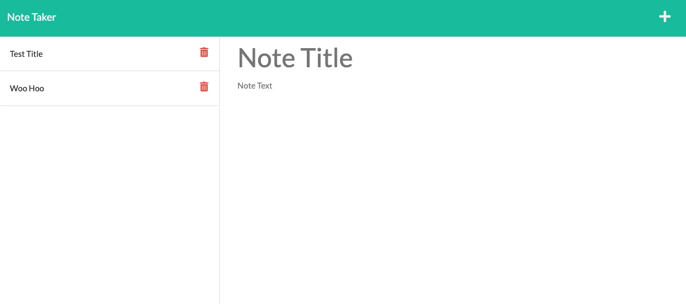

# Note Taker

## Description

This is an application called Note Taker that can be used to write and save notes. This application will use an Express.js back end and will save and retrieve note data from a JSON file.

### Table of Contents

---

- [Usage](#usage)
- [License](#license)
- [Contributing](#contributing)
- [Questions](#questions)

## Usage

Click on the link below called Note Taker App to use the app.

---

### License: MIT

---

## Contributing

Please read the installation section. For the repository owner, contribution guidelines are a way to communicate how people should contribute. For contributors, the guidelines help them verify that they're submitting well-formed pull requests and opening useful issues. For both owners and contributors, contribution guidelines save time and hassle caused by improperly created pull requests or issues that have to be rejected and re-submitted.

## Questions

If you have additional questions about this project please contact me directly at <crumwj22@hotmail.com>.
You can view more of my projects at <https://github.com/crumwj22>.

<a href="https://note-taker-jcrumley.herokuapp.com/">Link to Note Taker App</a>

